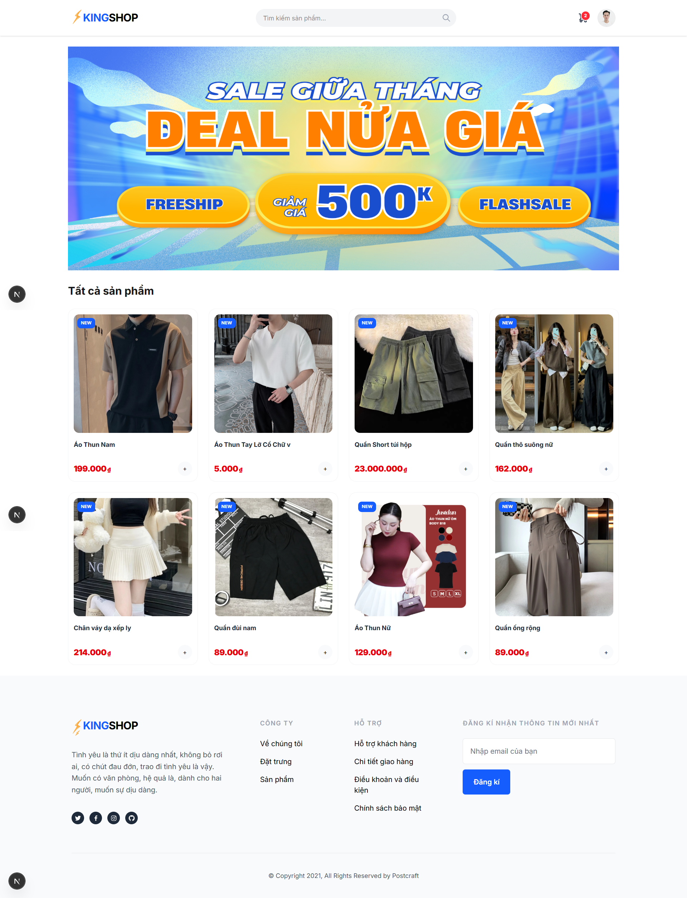
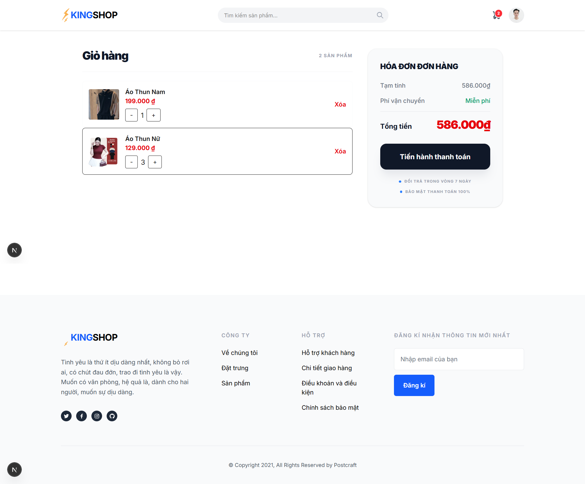
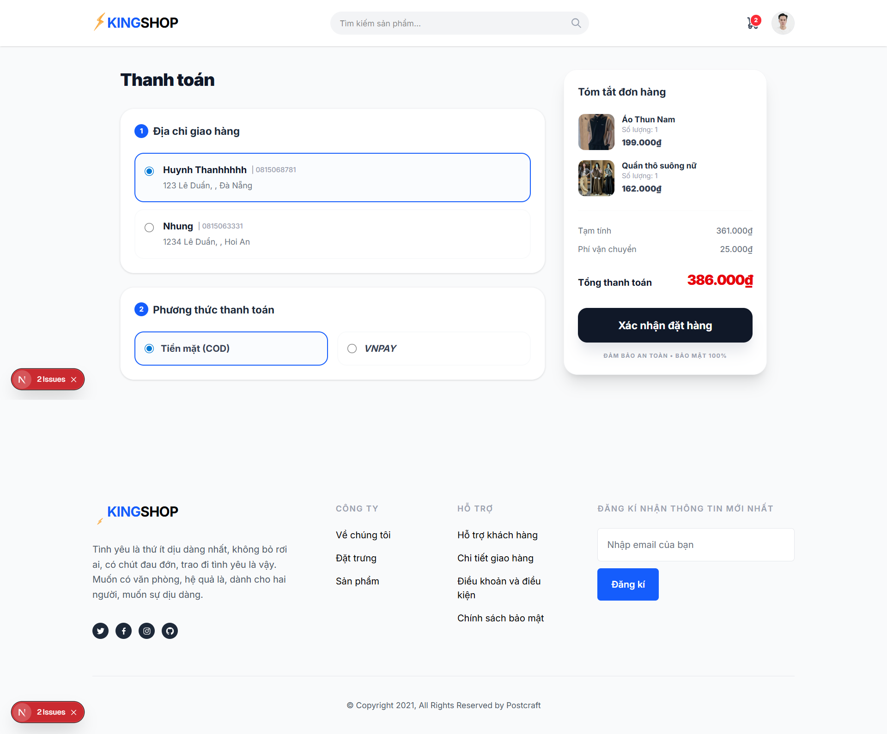
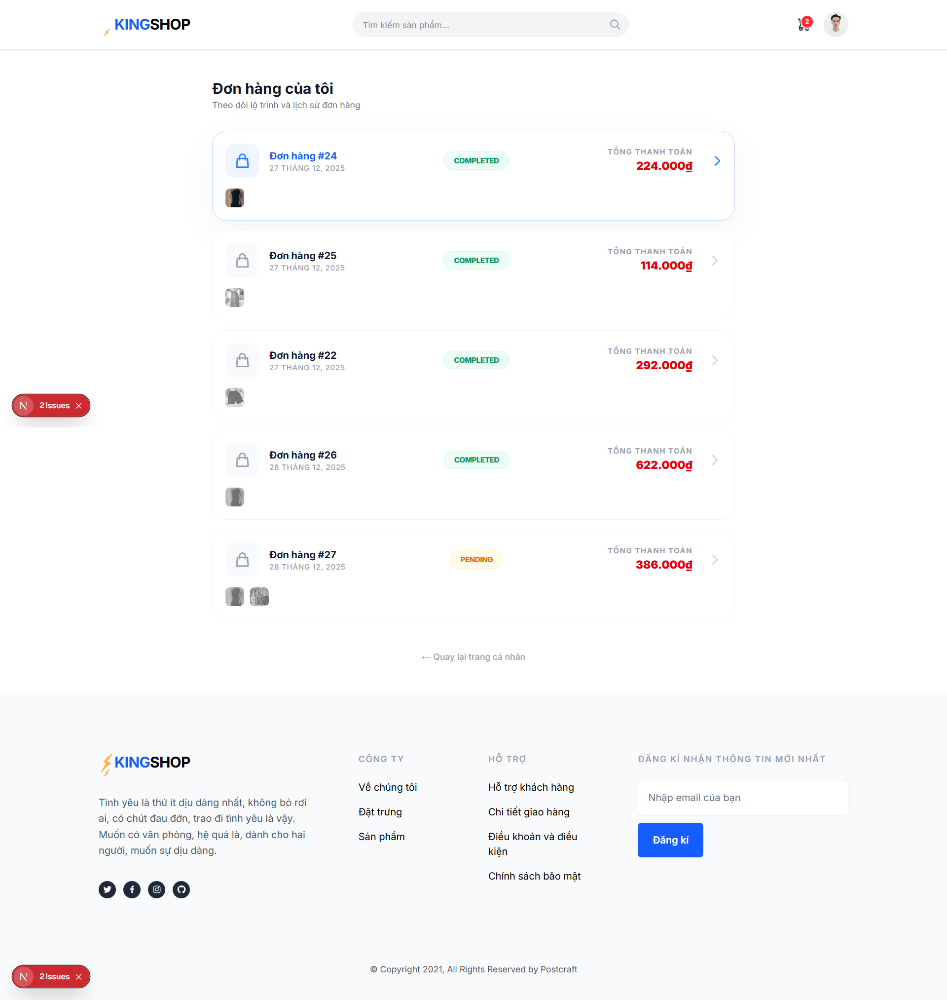
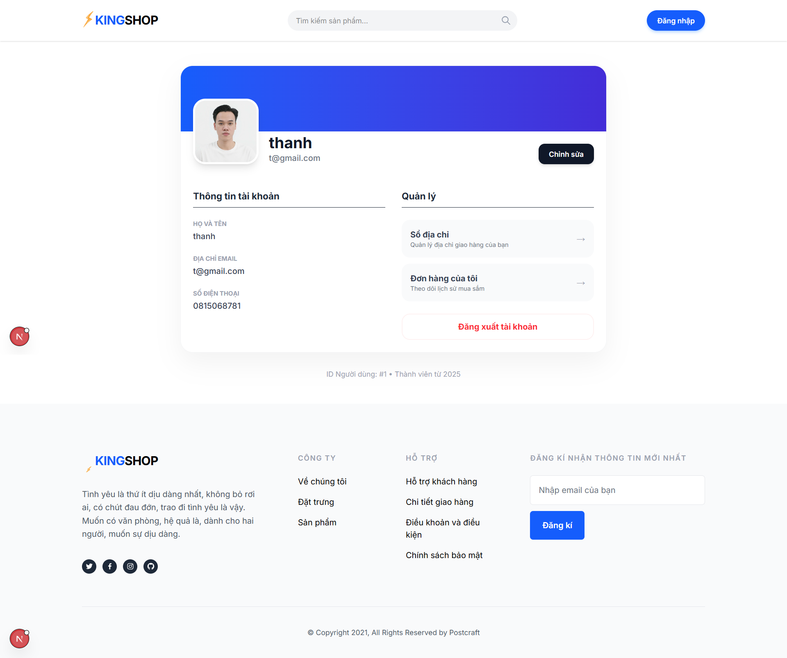
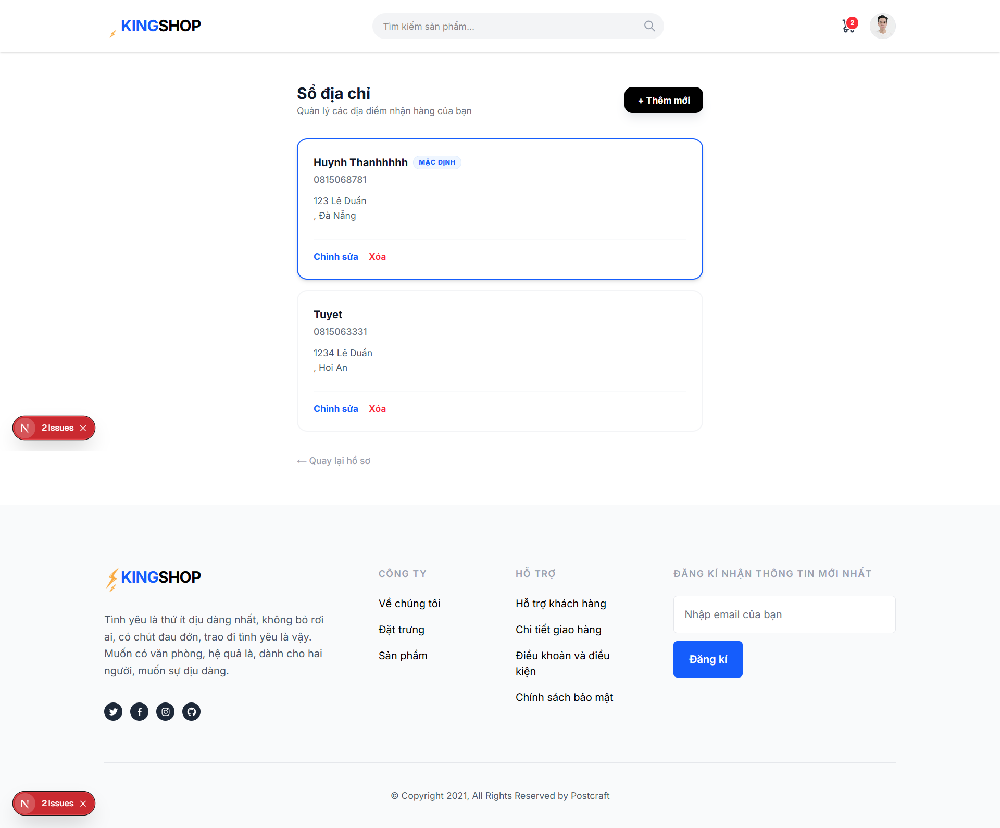
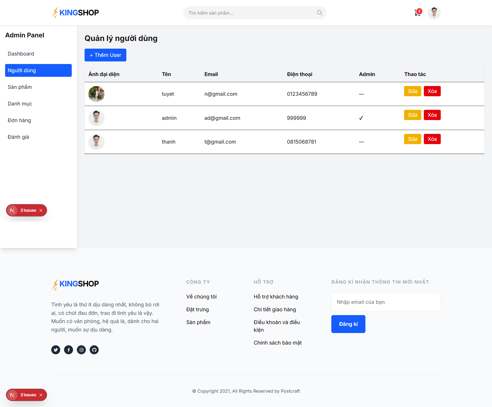
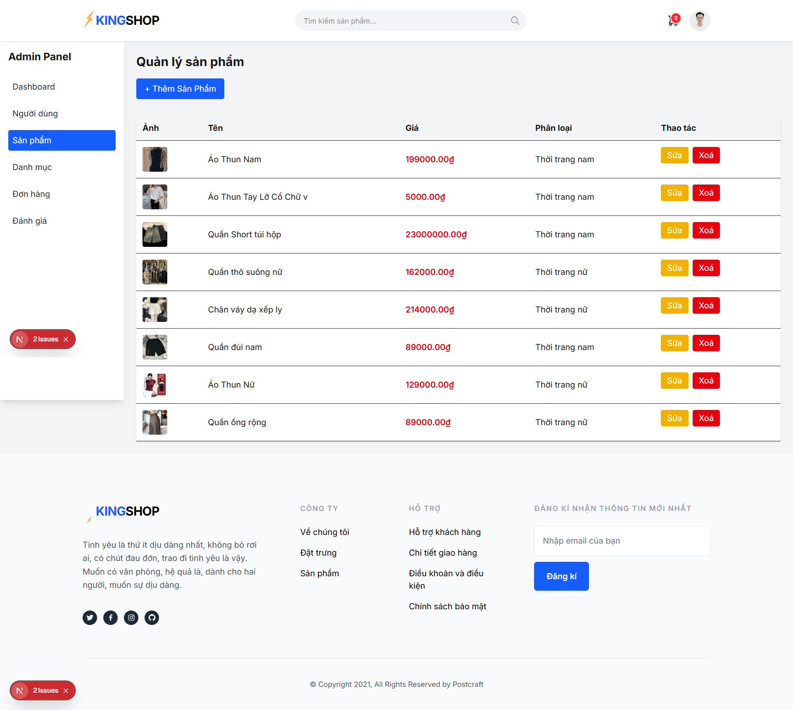
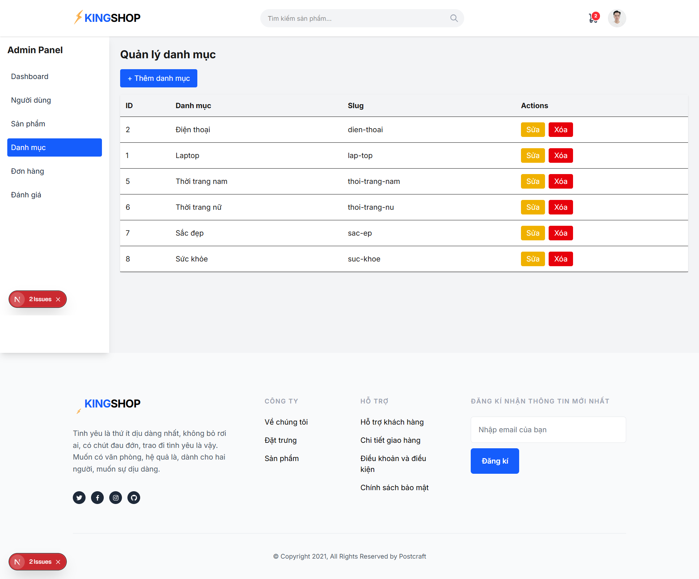
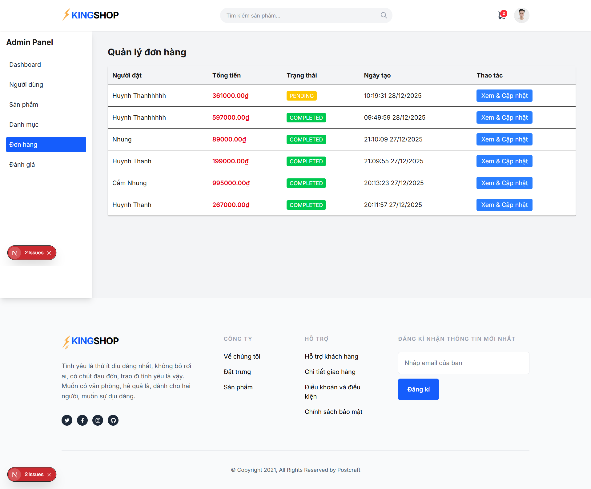

Here is the updated version of your **README.md** translated into English and professionally formatted.

# E-Commerce Project

## Project Description

This is a comprehensive full-stack e-commerce system featuring a backend API built with **Django REST Framework** and a frontend user interface developed using **Next.js** and **TypeScript**. The project provides essential online shopping features, including product management, shopping cart functionality, order processing, secure payments, and a robust administrative dashboard.

## Key Features

### Backend (Django)

* **Product Management**: CRUD operations for products with image support and categorization.
* **Cart Management**: Add/Remove items and manage persistent carts.
* **Order Management**: Order creation and lifecycle tracking.
* **Payment Integration**: Integrated with **VNPay** for secure online transactions.
* **User Management**: Authentication, Registration, and User Profile management.
* **Product Reviews**: Rating and comment system for customer feedback.
* **Admin Panel**: Built-in Django admin interface for quick data management.

### Frontend (Next.js)

* **Home Page**: Featured products display and promotional banners.
* **Product Catalog**: Category filtering and real-time search.
* **Product Details**: Detailed information, high-quality images, and customer reviews.
* **Shopping Cart**: Interactive management of selected items.
* **Checkout Process**: Streamlined workflow with shipping information entry.
* **Account Management**: Profile and shipping address management.
* **Order History**: Personal dashboard to track previous purchases.
* **Admin Dashboard**: Custom UI to manage products, orders, and users.

## Tech Stack

### Backend

* **Django 4.x**: Python web framework.
* **Django REST Framework**: RESTful API toolkit.
* **SQLite**: Database (easily migratable to PostgreSQL/MySQL).
* **Pillow**: Image processing library.
* **VNPay**: Payment gateway integration.

### Frontend

* **Next.js 14**: React framework for production.
* **TypeScript**: Static typing for safer code.
* **Tailwind CSS**: Utility-first CSS framework.
* **ESLint**: Pluggable linting utility.
* **PostCSS**: CSS transformation tool.

## Installation and Setup

### System Requirements

* Python 3.8+
* Node.js 18+
* npm or yarn

### Backend Setup

1. Create a virtual environment:

```bash
python -m venv .venv
.venv\Scripts\activate  # Windows
# source .venv/bin/activate  # Linux/Mac

```

2. Install dependencies:

```bash
pip install -r requirements.txt

```

3. Run migrations:

```bash
python manage.py migrate

```

4. Create a superuser (optional):

```bash
python manage.py createsuperuser

```

5. Start the server:

```bash
python manage.py runserver

```

The backend will be running at `http://localhost:8000`

### Frontend Setup

1. Navigate to the frontend directory:

```bash
cd ecommerce-fe

```

2. Install dependencies:

```bash
npm install

```

3. Start the development server:

```bash
npm run dev

```

The frontend will be running at `http://localhost:3000`

## Project Structure

```
ecommerce/
├── ecommerce/          # Main Django configuration
├── cart/               # Shopping cart application
├── orders/             # Order management application
├── payments/           # Payment gateway application
├── products/           # Product & Category application
├── media/              # Uploaded media files
├── db.sqlite3          # Database file
└── manage.py           # Django management script

ecommerce-fe/           # Next.js Frontend
├── src/
│   ├── app/           # Next.js app router & pages
│   ├── components/    # Reusable React components
│   ├── context/       # React Context (Auth, Cart)
│   └── lib/           # API utilities & helpers
├── public/            # Static assets
└── package.json

```

## API Endpoints

### Authentication (JWT)

* `POST /api/token/` - Login and obtain tokens
* `POST /api/token/refresh/` - Refresh access token
* `POST /api/token/verify/` - Verify token validity

### User Management

* `POST /api/users/register/` - User registration
* `POST /api/users/login/` - User login
* `GET /api/users/me/` - Get current user profile
* `PUT /api/users/me/update/` - Update profile information
* `GET /api/users/addresses/` - List shipping addresses
* `POST /api/users/addresses/` - Add new address
* `GET /api/users/addresses/{id}/` - Address details
* `PUT /api/users/addresses/{id}/` - Update address
* `DELETE /api/users/addresses/{id}/` - Delete address

### Product & Category

* `GET /api/products/` - List all products
* `POST /api/products/` - Create product (Admin)
* `GET /api/products/{id}/` - Product details
* `PUT /api/products/{id}/` - Update product (Admin)
* `DELETE /api/products/{id}/` - Delete product (Admin)
* `GET /api/categories/` - List all categories

### Cart & Orders

* `GET /api/cart/` - Get current cart
* `POST /api/cart/add/` - Add product to cart
* `POST /api/orders/checkout/` - Create order from cart
* `GET /api/orders/my-orders/` - User order history
* `PUT /api/orders/admin/{order_id}/status/` - Update order status (Admin)

---


## Contact

If you have any questions or need support, please open an issue on GitHub or contact via email.

*Developed with ❤️ using Django and Next.js*


## UI Demo

### Customer Interface

| Home Page | Product Details |
|---|---|
|  |  |

| Shopping Cart | Checkout |
|---|---|
|  |  | 

| VN PAY | Orders |
|---|---|
|  |  | 

| Profile | Addresses |
|---|---|
|  |  | 

Admin

| Users management | Products Management |
|---|---|
|  |  | 

| Categories management | Orders Management |
|---|---|
|  |  | 
